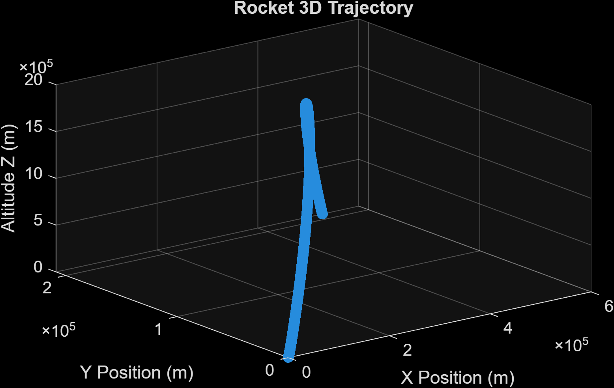

# 3D ROCKET TRAJECTORY SIMULATION 🚀

This MATLAB-based project simulates the three-dimensional trajectory of a rocket, accounting for key physical factors such as gravity, air resistance, thrust, variable mass, atmospheric density, the Coriolis effect, and crosswind forces. The goal is to model and visualize realistic rocket motion in a dynamic environment.

---

## 📌 Features

- ✅ 3D trajectory calculation in space (X, Y, Z)
- ✅ Real-time animated visualitation
- ✅ Variable mass due to fuel consumption
- ✅ Atmospheric density variation by altitude
- ✅ Crosswind modeling (speed and direction)
- ✅ Coriolis force based on launch latitude
- ✅ Drag coefficient calculated with Reynolds number
- ✅ Comparative analysis: with vs. without wind

---

## 📊 Visual Output

| Trajectory 3D | Wind vs. No Wind | Horizontal Deviation |
|---------------|------------------|------------------------|
|  |  |  |

---

## 🧠 Physics Behind the Model

The simulation incorporates realistic physics and engineering assumptions based on rocketry principles. Key components include:

---

### 🔹 Net Force Calculation
The total net force acting on the rocket is defined as:

---
  
### 🔹 Drag Force
Aerodynamic drag is computed using the standard quadratic drag formula:

Where:
- ρ = air density
- Cd = drag coefficient
- A = frontal area of the rocket
- v = velocity magnitude

---

### 🔹 Atmospheric Density Model:
The simulation uses a two-layer atmosphere:
- **Troposphere (0-11 km):** Temperature lapse rate model.
- **Stratosphere (>11 km):** Isothermal model with exponential decay.

---

### 🔹 Variable Mass
The rocket’s mass decreases over time as fuel burns, defined as:

.png)

Where \( \dot{m} \) is the mass flow rate derived from thrust and specific impulse:

---

### 🔹 Coriolis Force
Due to Earth's rotation, a Coriolis term is added to the dynamics for lateral deflection, especially at non-equatorial latitudes. 

---

## 📁 Files

| File | Description |
| ---- | ----------- |
| `main.xlx` | Live script that runs full simulation and plots |
| `simulate_rocket_3D.m` | Core physics simulation |
| `draw_rocket3D.m` | 3D visualization of the rocket |
| `simulate_and_draw_rocket3D.m` | Animated simulation |
| `compare_wind_effect.m` | Comparative plots (wind vs. no wind) |
| `calculate_Cd0.m` | Drag coefficient calculation |

---

## 🧑‍💻 About me

I'm Joaquin, a freshman at **Purdue University** majoring in Aerospace Engineering. This project was developed to deepen my understanding of rocket dynamics and prepare for research opportunities in propulsion and trajectory modeling 

Feel free to reach out or connect with me on [LinkedIn](https://pe.linkedin.com/in/joaquin-alarcon)

---

## 📬 Contact:

- 📧 Email: joaq.alrc@outlook.com
- 🌐 Github : [@joaquinalarc](https://github.com/joaquinalarc)
- 📸 Instagram : [@joa.alarcon_](https://www.instagram.com/joa.alarcon_/)

## 💖 Support:

Liked this project? Help me keep building rockets (and maybe buy some coffee too):

☕ [Donate via Paypal](https://www.paypal.me/joaquix96)
